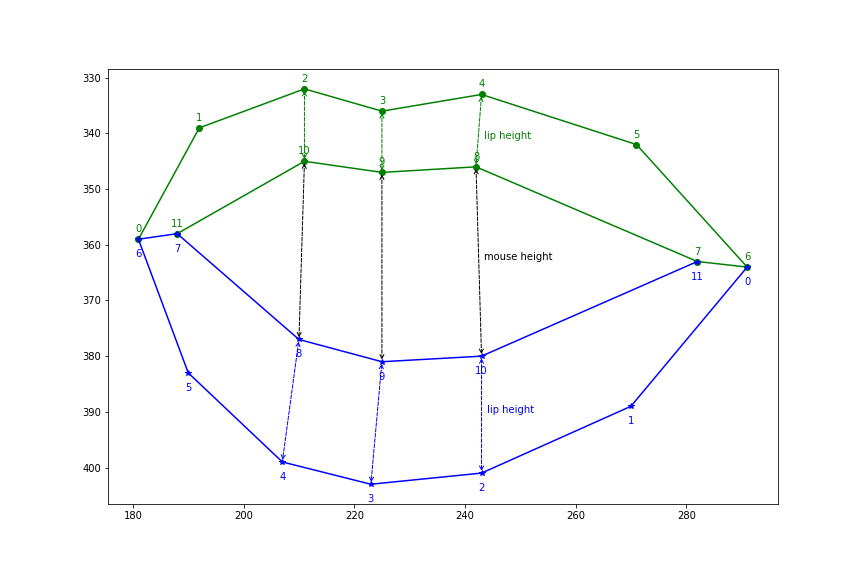

# detect_mouth_open
An simple algorithm to detect mouth open utilizing feature outputs from face_recognition project.

Check this [Medium post](https://towardsdatascience.com/build-face-recognition-as-a-rest-api-4c893a16446e?source=friends_link&sk=5b89a9cbfc997aee59743c504c3bf068) for more details.

## Algorithm
Mouth points and measurements:

Corresponding facial features:

## Prerequisite
Install [face_recognition](https://github.com/ageitgey/face_recognition.git) package first.

## Run real-time webcam example
git clone https://github.com/peterjpxie/detect_mouth_open.git

cd detect_mouth_open

python facerec_from_webcam_mouth_open.py
